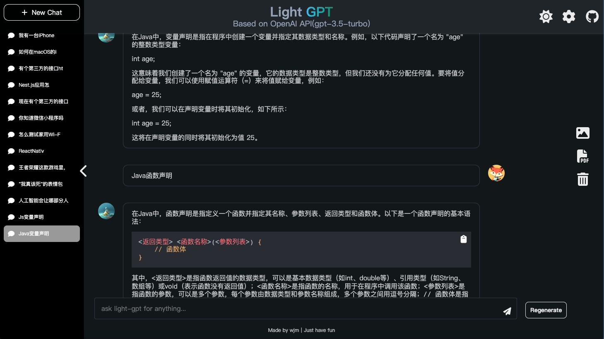
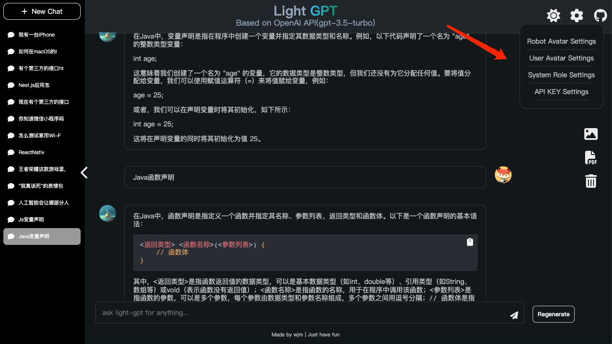

# Light-GPT

Light-GPT is an interactive website project based on the GPT-3.5-Turbo model. It is built using the Next.js framework and deployed on the Vercel cloud platform. It is a pure front-end lightweight application.

Github: https://github.com/riwigefi/light-gpt

Demo: https://light-gpt.vercel.app

## Features

1. A pure front-end application based on the GPT-3.5-Turbo model, using API KEY to request OpenAI's dialogue interface in the front-end, supporting streaming data, and displaying robot replies on the webpage in a typewriter effect.
2. After deployment, users can set their API KEY on the front-end page. With scientific internet access, the Q&A speed will be very fast. The user's API KEY will be saved on the client-side, which means there is no risk of leakage.
3. Supports new thematic dialogues and viewing of historical thematic dialogues. All dialogue data is stored in the IndexedDB of the browser, which means that dialogue data records are saved locally and there is no risk of data leakage.
4. AI replies to programming-related questions support multiple syntax highlighting and one-click code copying.
   Dialogues support image export and PDF export.
5. The application is adapted for both PC and mobile devices, making it convenient to use.
6. DIY, supporting setting user avatars and AI avatars.

## Site Preview





## Local Deployment

To deploy Light-GPT locally, follow these steps (requires node16 or higher):

1. Download the project to your local machine:

```bash
git clone https://github.com/riwigefi/light-gpt.git
```

2. Navigate to the project directory and install dependencies:

```bash
cd light-gpt
pnpm install
```

3. Start the application:

```bash
pnpm run dev
```

The project will now be available for preview at http://localhost:3000. Enter your API KEY on the front-end page to start chatting.

## Vercel Online Deployment

To deploy Light-GPT on Vercel's cloud platform:

1. Register for a Vercel account at https://vercel.com. A mobile verification code is required.

2. Fork the https://github.com/riwigefi/light-gpt repository to your own Github account.

3. Log in to the Vercel platform, click "Add New", select "Project", and then import the Github project you just forked. Click "Deploy".

## Docker Local Deployment

For those who prefer to use Docker for local deployment:

1. Pull the Docker image:

```bash
docker pull whynotisme/light-gpt
```

2. Run the image and map port 8080 to port 80:

```bash
docker run -p 8080:80 whynotisme/light-gpt
```

# Light-GPT（中文介绍）

Light-GPT 是一个基于 GPT-3.5-Turbo 模型的交互式网站项目，使用 Next.js 框架构建，使用 Vercel 云平台部署，是一个纯前端的轻量级应用。

Github 代码库: https://github.com/riwigefi/light-gpt

演示站点: https://light-gpt.vercel.app

## 功能

1. 纯前端应用，基于 GPT-3.5-Turbo 模型，使用 API KEY 在前端请求 OpenAI 的对话接口，支持流式数据，页面以打字机效果显示机器人回复。
2. 部署后，用户在前端页面设置自己的 API KEY，科学上网的情况下，问答速度会很快。用户设置的 API KEY 将保存在客户端，完全没有泄漏风险。
3. 支持新的主题对话和查看历史主题对话。所有对话数据都存储在浏览器的 IndexedDB 中，也就是说对话数据记录是保存在本地的，不会有数据泄漏风险。
4. AI 回复支持多种语法高亮和一键复制代码功能，针对编程相关问题。对话支持图片和 PDF 导出。
5. 应用适配了 PC 和 Mobile 设备，方便使用。
6. 支持 DIY，支持设置用户头像和 AI 头像。

## 站点预览


## 本地部署

要在本地部署 Light-GPT，按照以下步骤操作(需要 node16 及以上版本)：

1. 将项目下载到本地:

```bash
git clone https://github.com/riwigefi/light-gpt.git
```

2. 进入项目目录并安装依赖项:

```bash
cd light-gpt
pnpm install
```

3. 启动应用程序:

```bash
pnpm run dev
```

这样，项目就能在 http://localhost:3000 上预览了。在前端页面输入你的 API KEY，就可以愉快对话了。

## Vercel 线上部署

1. 注册一个 Vercel 云平台部署账号，访问 https://vercel.com，需要国外的手机验证码校验。

2. 将 https://github.com/riwigefi/light-gpt 这个仓库 fork 到你的 Github。
3. 登录 Vercel 平台，点击 "Add New"，选择 "Project"，然后 import 刚刚 fork 的 Github 项目，点击部署即可。

## Docker 本地部署

为方便使用，本项目也提供了 Docker 镜像。

1. 拉取 Docker 镜像:

```bash
docker pull whynotisme/light-gpt
```

2. 运行镜像并将端口 8080 映射到端口 80:

```bash
docker run -p 8080:80 whynotisme/light-gpt
```

## 重要提示

**本地部署时，请务必保证你是科学上网环境，你可以正常访问 open ai 官网，如果不能，请不要设置 api key 进行调试，否则会有封号风险**
